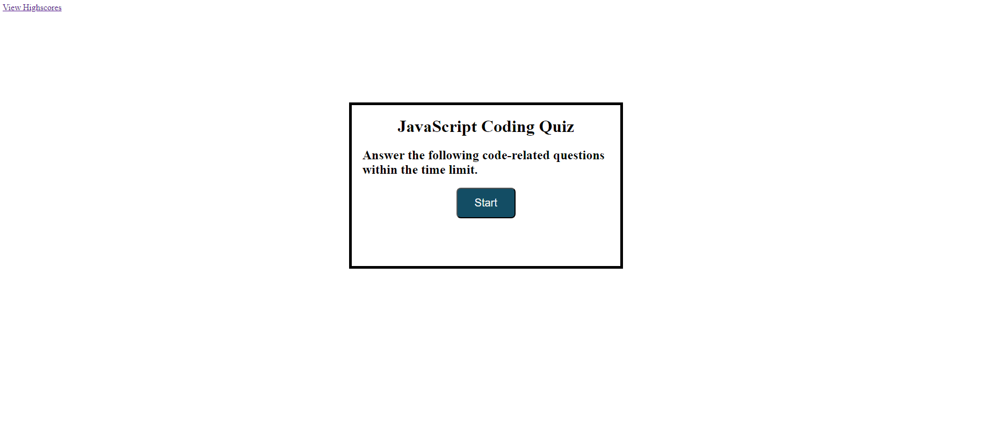

# Acceptance Criteria
GIVEN I am taking a code quiz
WHEN I click the start button
THEN a timer starts and I am presented with a question
WHEN I answer a question
THEN I am presented with another question
WHEN I answer a question incorrectly
THEN time is subtracted from the clock
WHEN all questions are answered or the timer reaches 0
THEN the game is over
WHEN the game is over
THEN I can save my initials and score
# Repo Link

https://github.com/1014jorge/Quiz-Challenge

# Web Link For App
https://1014jorge.github.io/Quiz-Challenge/

# Screenshot 
Added screenshot of quiz start page and high score page.

